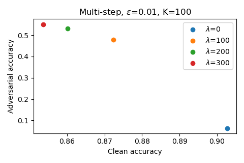

# Flow-Gradient-Regularization (PyTorch)

<div align=center>  </div>

[Improving Resistance to Adversarial Deformations by Regularizing Gradients](https://www.sciencedirect.com/science/article/pii/S0925231221008080)

Pengfei Xia and Bin Li, *Neurocomputing*

>Abstract: *Improving the resistance of deep neural networks against adversarial attacks is important for deploying models in realistic applications. Nowadays, most defense methods are designed to resist intensity perturbations, and location perturbations have not yet attracted enough attention. However, these two types should be equally important for deep model security. In this paper, we focus on adversarial deformations, a typical class of location perturbations, and propose a defense method named flow gradient regularization to improve the resistance of models against such attacks. By theoretical analysis, we prove that regularizing flow gradients is able to get a tighter bound than regularizing input gradients. Through verifying over multiple datasets, network architectures, and adversarial deformations, our empirical results indicate that training with flow gradients performs better than training with input gradients by a large margin, and also better than adversarial training. Moreover, the proposed method can be used to combine with adversarial deformation training to improve the resistance further.*

## Training

```python
# Train VGG-11 on CIFAR-10 without FGR
python main.py --data_path your_path --data_name cifar10 --model_name vgg11 --fgr_lamb 0

# Train VGG-11 on CIFAR-10 with FGR and lambda set to 300
python main.py --data_path your_path --data_name cifar10 --model_name vgg11 --fgr_lamb 300
```

## Evaluating

```python
# Evaluate VGG-11 trained on CIFAR-10 without FGR
python evaluate.py --data_path your_path --data_name cifar10 --model_name vgg11 --fgr_lamb 0

# Evaluate VGG-11 trained on CIFAR-10 with FGR and lambda set to 300
python evaluate.py --data_path your_path --data_name cifar10 --model_name vgg11 --fgr_lamb 300
```

## Citation

If you find this work useful for your research, please cite our paper:

```
@article{xia2021improving,
  title={Improving resistance to adversarial deformations by regularizing gradients},
  author={Xia, Pengfei and Li, Bin},
  journal={Neurocomputing},
  volume={455},
  pages={38--46},
  year={2021},
  publisher={Elsevier}
}
```
